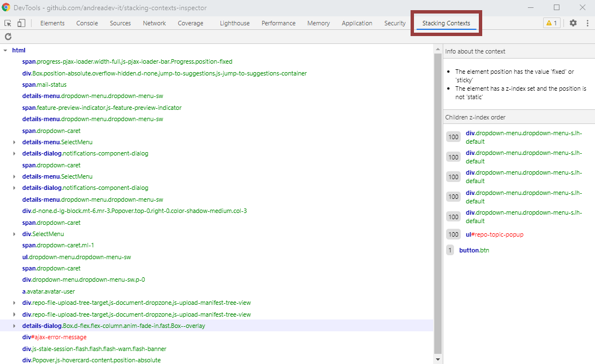
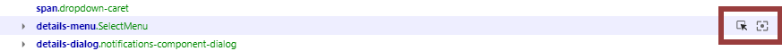
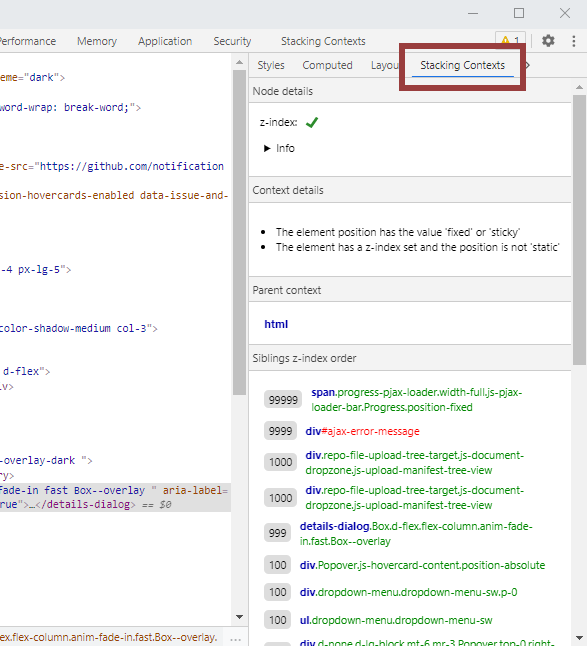

# Stacking Contexts Inspector
The Stacking Contexts Inspector is a [devtools extension for Google Chrome](https://chrome.google.com/webstore/detail/css-stacking-context-insp/apjeljpachdcjkgnamgppgfkmddadcki) and [Firefox](https://addons.mozilla.org/en-US/firefox/addon/css-stacking-context-inspector/) that allows you to analyse the stacking contexts available on a webpage. Here you will find all the informations you need to get up and running with using this tool. 

This extension will add a **new panel** to the devtools and a **new sidebar** on the elements panel.

### Known bugs and things to keep in mind
* This extension work by analysing the page at a specific point in time (when you open the panel or the sidebar). It won't automatically react to changes in the inspected page, but it will show you a warning when it detects changes that might be altering the stacking contexts. When you see that warning, you can use a button to refresh the stacking contexts at any time.
* This extension can't currently analyse third-party iframes within the page (work in progress).

If you find any other issue or have some feature request, feel free to use the [Issues section](https://github.com/andreadev-it/stacking-contexts-inspector/issues) here on github to share them.

## The Stacking Contexts panel
This panel will show you a tree-like representation of all the stacking contexts available on the page. It will also show some "containers" that represent the document that the stacking contexts reside within (useful to instantly see which stacking contexts were found within iframes). These containers will be shown with a bold, italic font and a grey color (the `#document` root is an exemple of a container).

When hovering over a context, the DOM element will be highlighted in the page. If you don't see any highlight, it might be because the element is not visible, or it's outside of the viewport.

When you hover over a context, or have a specific context selected (everywhere within the extension), two buttons will appear on the right of the context: **Inspect** and **Scroll into view**.

**Inspect** will select the DOM element in the elements panel. **Scroll into view** will scroll the page in order to show the DOM element related to the context.

If you click on a context, it will be selected and some in-depth information will be shown on the sidepane.

### The panel sidepane
The sidepane shows information related to the stacking context that is currently selected in the tree view. It is divided into two sections: **Info about the context** and **Children z-index order**.

In the first section, you can see why this DOM element is creating a new stacking context. There might be multiple reasons for this, and all of them will be shown as an unordered list in this section.

In the second section, you can find a list of all the stacking contexts that are children of the selected context. They'll be ordered from the one which is visible on top (higher z-index) to the one that will show behind everything else (lower z-index). It will also show all the elements that have no z-index applied, but have a position of "relative" or "absolute", since these values will slightly alter the order the elements are printed (might be changed in the future). When you hover over the contexts in this view, two buttons will appear on the right (the same as in the tree view). They allow you to inspect the related DOM element or scroll the viewport to show it.

## The Stacking Contexts sidebar in the Elements panel
When you install this extension, a new sidebar will be added to the right of the elements panel, where you can also find the "Styles", "Computed", "Layout" and other sidebars. It might not be immediatly visible, in that case you can make the sidebar larger to show all options, or click on the "»" button in the top-right to show all the hidden sidebars names.

In the first option bar, you can see a button with a "refresh" icon (on the right of "Node details"). Press that button whenever there are some changes in the page that could impact the stacking contexts.

The sidebar is divided into multiple sections:

### Node details
This section will give you an immediate feedback on whether or not the z-index property is working on the DOM element. If the element selected has no z-index and doesn't create a stacking context, a coherent message will appear.

### Context details
This section will show an unordered list that explains why the current element is creating a new stacking context. If you don't want it to be creating a context, you can use this information to know where to tweak your CSS.

### Parent context
This is very self-explanatory: it just shows which element is the parent stacking context. It will show you the element which is the closest ancestor to the currently selected element, and which also creates a stacking context.

### Siblings z-index order
Similarly to the "children z-index order" in the Stacking Context panel, it will show a list of stacking contexts along with their z-indexes, in order from the one that shows on top to the one that shows behind everything (from highest to lowest z-index).
The stacking contexts shown in this list are the ones that directly compare to the current element on their z-index values, since they're all children of the same stacking context. The currently selected context will also appear on this list.
